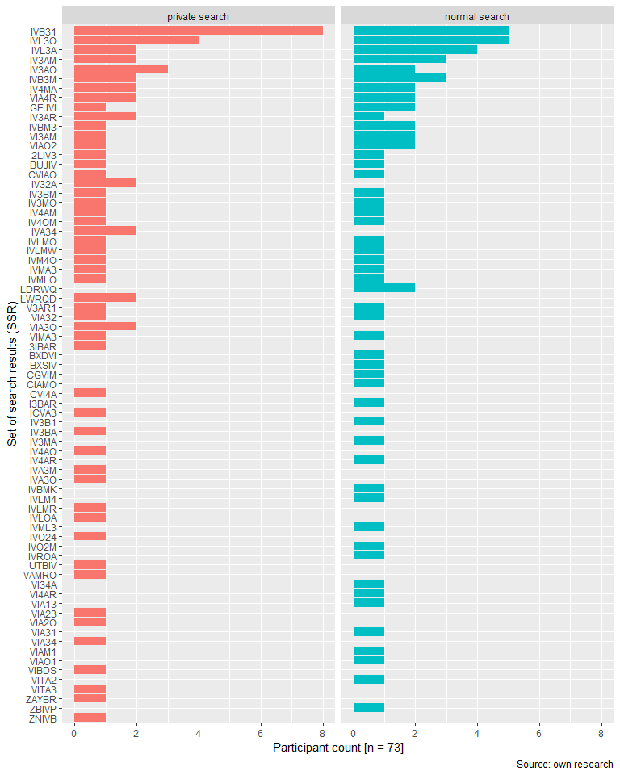

Bobcatsss 2020 summary
================
Remigiusz Żulicki, Michał Żytomirski
22 01 2020

## Distribution of domains vs order in set of search results vs browser mode

28 unique domains

<!-- -->

## What is a set of search results (SSR)?

First five organic Google search results (top domains\!) encoded as
single characters

Most common example:

| Single character encoding | Top domain        |
| :------------------------ | :---------------- |
| I                         | pl.wikipedia.org  |
| V                         | www.facebook.com  |
| B                         | bialystok.onet.pl |
| 3                         | www.wprost.pl     |
| 1                         | www.trojmiasto.pl |

Source: own research

## SSR distribution vs browser mode

50 SSRs in normal mode - 37 of 73 participants saw a unique SSR 51 SSRs
in incognito mode - 38 of 73 participants saw a unique SSR

**More than a half of participants saw a unique set of results**

<!-- -->

## Measuring difference between normal and private search

Optimal string alignment distance(OSA) adapted from Mark P.J. van der
Loo <https://journal.r-project.org/archive/2014-1/loo.pdf>

  - substitution of a character: ‘foo’→‘boo’.
  - deletion of a character: ‘foo’→‘oo’.
  - insertion of a character: ‘foo’→‘floo’.
  - transposition of two adjacent characters: ‘foo’→‘ofo’.

Each of weight 1.

In out case OSA must be an integer, between 0 (no difference) and 5

**29 of 73 participants saw the same SSR (OSA = 0) in both private and
incognito search. Even more - 36 of 73 - saw just a permutation**.

<!-- -->

## In search for independent variables

**The difference (OSA distance) between normal and private search was
lower for participant with less personalized search result sets in
normal search**

<!-- -->

*W* = 697.5, *p* \< 0.05, *r* = -0.252 (*effect size* small to medium).
