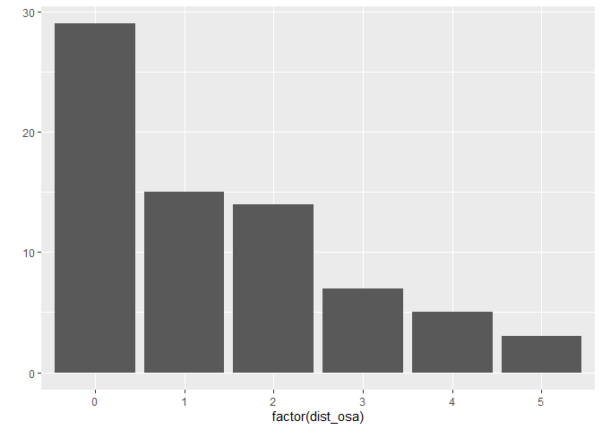
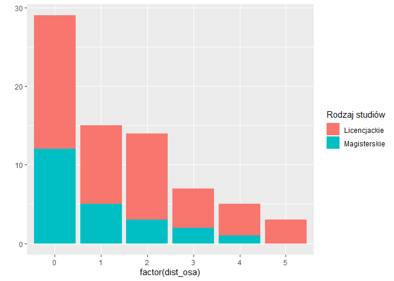
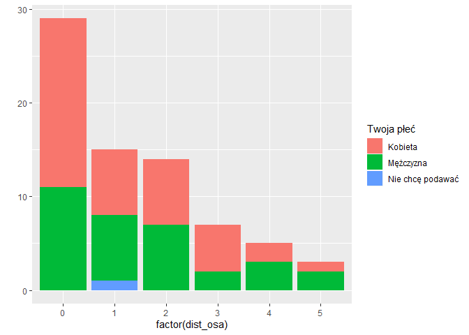
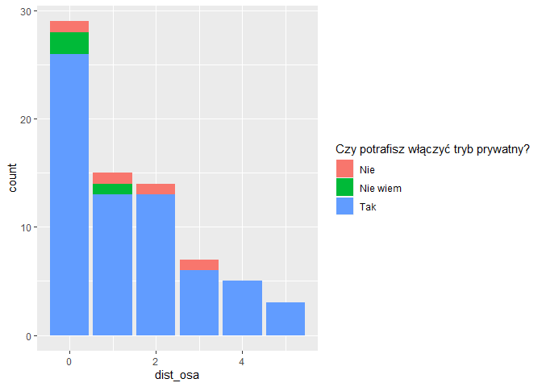
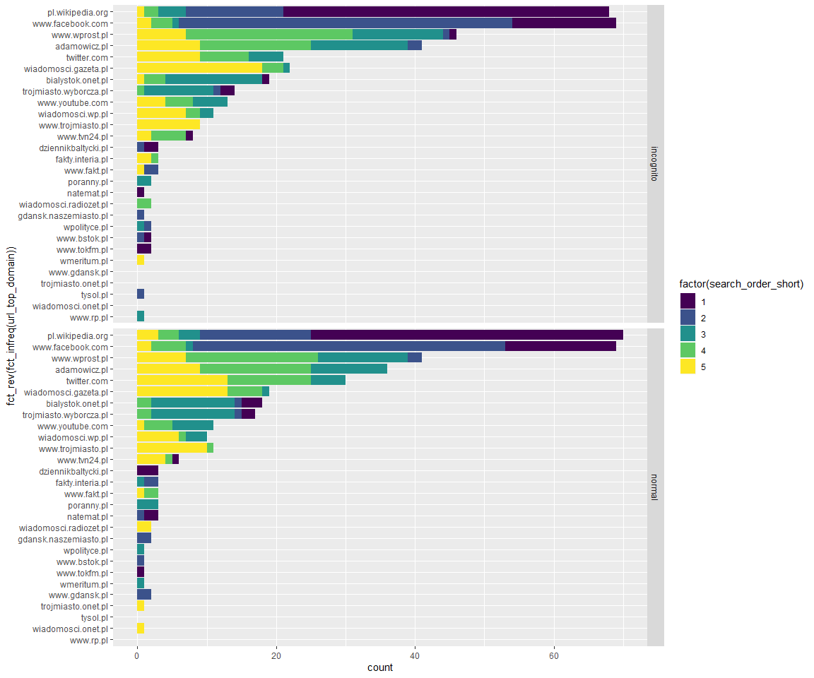

filter\_bubble\_test\_summary
================
Remigiusz Żulicki
20 08 2019

## Róźnica w wynikach wyszukiwania: tryb normalny vs. incognito

Różnica wyrażona jest w liczbach całkowitych 0 - 5. Zero oznacza, że
wyniki były identyczne. Róźnica \> 0 oznacza, że wystąpiły różnice.

Różnicę obliczyliśmy metodą “osa” z pakietu stringdist
<https://journal.r-project.org/archive/2014-1/loo.pdf> Metoda ta daje
wyniki identyczne z metodą zastosowaną w badaniu DDG.

Brane są pod uwagę cztery scenariusze:

  - Substitution of a character, as in ‘foo’→‘boo’.
  - Deletion of a character, as in ‘foo’→‘oo’.
  - Insertion of a character, as in ‘foo’→‘floo’.
  - Transposition of two adjacent characters, as in ‘foo’→‘ofo’.

z których każdy ma wagę 1. U nas mogły wystąpić tylko dwa: substytucja i
transpozycja.

Podsumowanie różnicy poniżej:

    ##    Min. 1st Qu.  Median    Mean 3rd Qu.    Max. 
    ##   0.000   0.000   1.000   1.356   2.000   5.000

Rozkład
różnicy:

<!-- -->

    ## 
    ##  0  1  2  3  4  5 
    ## 29 15 14  7  5  3

## Różnica w grupach

W podziale na rodzaj studiów:

<!-- -->

W podziale na płeć:

<!-- -->

W podziale na umiejętność włączenia trybu incognito:

<!-- -->

## Rozkład wyników wyszukiwania

Każdej domenie przypisaliśmy znak (literę albo cyfrę), na potrzebę
obliczenia wyżej omówionej różnicy między wynikami wyszukiwania -
różnicy liczonej jako odległość pomiędzy ciągami znaków.

Łącznie w obu trybach wyszukiwania uczestnicy naszego badania uzyskali
28 różnych domen.

| url\_top\_domain       | letter\_top\_domain |   n |
| :--------------------- | :------------------ | --: |
| adamowicz.pl           | A                   |  77 |
| bialystok.onet.pl      | B                   |  37 |
| dziennikbaltycki.pl    | C                   |   6 |
| fakty.interia.pl       | D                   |   6 |
| gdansk.naszemiasto.pl  | E                   |   3 |
| natemat.pl             | G                   |   4 |
| pl.wikipedia.org       | I                   | 138 |
| poranny.pl             | J                   |   5 |
| trojmiasto.onet.pl     | K                   |   1 |
| trojmiasto.wyborcza.pl | L                   |  31 |
| twitter.com            | M                   |  51 |
| tysol.pl               | N                   |   1 |
| wiadomosci.gazeta.pl   | O                   |  41 |
| wiadomosci.onet.pl     | P                   |   1 |
| wiadomosci.radiozet.pl | Q                   |   4 |
| wiadomosci.wp.pl       | R                   |  21 |
| wmeritum.pl            | S                   |   2 |
| wpolityce.pl           | T                   |   3 |
| www.bstok.pl           | U                   |   3 |
| www.facebook.com       | V                   | 138 |
| www.fakt.pl            | W                   |   6 |
| www.gdansk.pl          | X                   |   2 |
| www.rp.pl              | Y                   |   1 |
| www.tokfm.pl           | Z                   |   3 |
| www.trojmiasto.pl      | 1                   |  20 |
| www.tvn24.pl           | 2                   |  14 |
| www.wprost.pl          | 3                   |  87 |
| www.youtube.com        | 4                   |  24 |

Rozkład domen w podziale na kolejność na liście wyszukiwania i tryb
przeglądarki

<!-- -->

Rozkład wyników wyszukiwania w podziale na tryb
przeglądarki

<!-- -->

Przykładowo najczęściej pojawiający się (8 na 73 wyniki) w trybie
incognito zestaw wyników IVB31 oznacza, że osoba w odpowiedzi na
zapytanie “Paweł Adamowicz” w wyszukiwarce Google uzyskała następujące
domeny w podanej kolejności:

| letter\_top\_domain | url\_top\_domain  |
| :------------------ | :---------------- |
| I                   | pl.wikipedia.org  |
| V                   | www.facebook.com  |
| B                   | bialystok.onet.pl |
| 3                   | www.wprost.pl     |
| 1                   | www.trojmiasto.pl |
